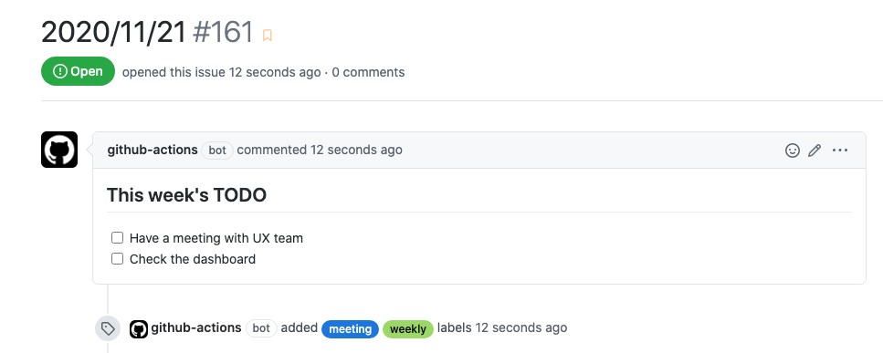

# Action Create Issue

[![actions-workflow-test][actions-workflow-test-badge]][actions-workflow-test]
[![release][release-badge]][release]
[![license][license-badge]][license]



This is a GitHub Action to create an issue.

## Inputs

|      NAME      |                                                                 DESCRIPTION                                                                 |   TYPE   | REQUIRED |          DEFAULT           |
|----------------|---------------------------------------------------------------------------------------------------------------------------------------------|----------|----------|----------------------------|
| `github_token` | A GitHub token.                                                                                                                             | `string` | `true`   | `N/A`                      |
| `title`        | The title of the created issue.                                                                                                             | `string` | `true`   | `N/A`                      |
| `body`         | The body of the created issue.                                                                                                              | `string` | `false`  | `N/A`                      |
| `repo`         | The owner and repository name. e.g.) Codertocat/Hello-World                                                                                 | `string` | `false`  | `${{ github.repository }}` |
| `labels`       | The labels which are added to the created issue when it's created. Must be separated with line breaks if there're multiple labels.          | `string` | `false`  | `N/A`                      |
| `milestone`    | The number of the milestone to which the created issue is added when it's created.                                                          | `number` | `false`  | `N/A`                      |
| `assignees`    | The assignees which are assigned to the created issue when it's created. Must be separated with line breaks if there're multiple assignees. | `string` | `false`  | `N/A`                      |

## Example

```yaml
name: Create an issue on Monday

on:
  schedule:
    - cron: '0 9 * * 1' # At 09:00 on Monday

jobs:
  create_issue:
    runs-on: ubuntu-latest
    steps:
      - name: Get today's date
        id: date
        run: |
          echo "::set-output name=today::$(date "+%Y/%m/%d")"

      - name: Create an issue
        uses: actions-ecosystem/action-create-issue@v1
        with:
          github_token: ${{ secrets.github_token }}
          title: ${{ steps.date.outputs.today }}
          body: |
            ## This week's TODO

            - [ ] Have a meeting with UX team
            - [ ] Check the dashboard

          labels: |
            meeting
            weekly

```

## License

Copyright 2020 The Actions Ecosystem Authors.

Action Create Issue is released under the [Apache License 2.0](./LICENSE).

<!-- badge links -->

[actions-workflow-test]: https://github.com/actions-ecosystem/action-create-issue/actions?query=workflow%3ATest
[actions-workflow-test-badge]: https://img.shields.io/github/workflow/status/actions-ecosystem/action-create-issue/Test?label=Test&style=for-the-badge&logo=github

[release]: https://github.com/actions-ecosystem/action-create-issue/releases
[release-badge]: https://img.shields.io/github/v/release/actions-ecosystem/action-create-issue?style=for-the-badge&logo=github

[license]: LICENSE
[license-badge]: https://img.shields.io/github/license/actions-ecosystem/action-create-issue?style=for-the-badge
